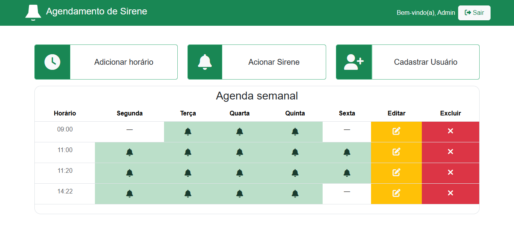
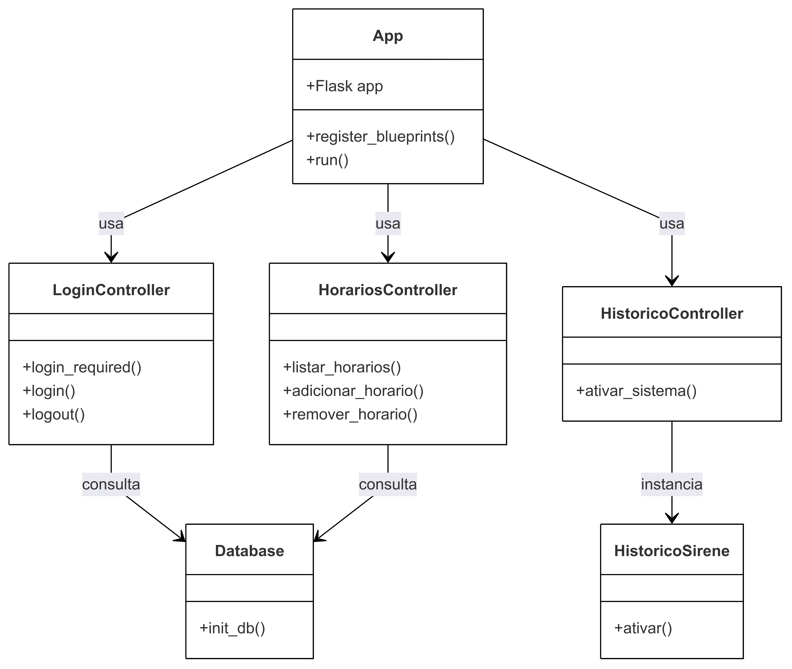

# Sistema de Agendamento de Sirene Escolar





## Descrição
Este sistema permite o agendamento de horários para acionamento de uma sirene escolar, utilizando um Arduino para a execução.

## Tecnologias Utilizadas
- Python
- Flask (para API REST)
- SQLite (banco de dados)
- PySerial (comunicação com Arduino)

## Instalação e Execução
```bash
   python -m venv venv
   
   venv\Scripts\activate
   
   pip install -r requirements.txt
   
   python app.py
```
